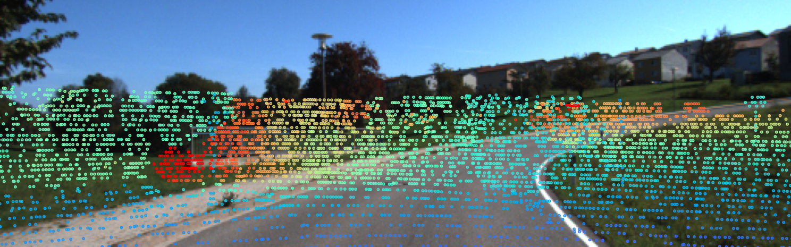

<p align="center">


  <h1 align="center">Differentiable Registration of Images and LiDAR Point Clouds with VoxelPoint-to-Pixel Matching </h1>
  <p align="center">
    <a href="https://junshengzhou.github.io/"><strong>Junsheng Zhou*</strong></a>
    ·
    <a href="https://mabaorui.github.io/"><strong>Baorui Ma*</strong></a>
    ·
    <a href="https://scholar.google.com/citations?hl=zh-CN&user=qzH0hNAAAAAJ"><strong>Wenyuan Zhang</strong></a>
    ·
    <a href="https://scholar.google.com/citations?hl=zh-CN&user=j-cyhzwAAAAJ"><strong>Yi Fang</strong></a>
    ·
    <a href="https://yushen-liu.github.io/"><strong>Yu-Shen Liu</strong></a>
    ·
    <a href="https://h312h.github.io/"><strong>Zhizhong Han</strong></a>

  </p>
  <h2 align="center">NeurIPS 2023</h2>
  <div align="center"></div>
</p>

We release the code of the paper <a href="https://arxiv.org/abs/2312.04060">Differentiable Registration of Images and LiDAR Point Clouds with VoxelPoint-to-Pixel Matching</a> in this repository.

## Overview
<p align="center">
  
</p>
Given a pair of mis-registered image 𝐼 and point cloud 𝑃 as input, (a) we first operate sparse voxelization to generate the sparse voxel 𝑉, and the triplet network is then applied to extract patterns from the three modalities. We represent the 2D patterns as the pixel features and the 3D patterns as the combination of voxel and point features, respectively. The adaptive-weighted loss is then used to learn distinctive 2D-3D cross-modality patterns. (b) We detect the intersection regions on 2D/3D space with cross-modality feature fusion. (c) We remove the outlier regions based on the results of intersection detection and build 2D-3D correspondences with 2D-3D feature matching, where the probabilistic PnP is then applied to predict the distribution of the extra poses to impose end-to-end supervisions with ground truth poses.

## Registration Results
### KITTI
<p align="center">
  
</p>

### NuScenes
<p align="center">
  
</p>

## Feature Matching Results
<p align="center">
  
</p>


## Installation
Our code is implemented in Python 3.8, PyTorch 1.11.0 and CUDA 11.3.
- Install python Dependencies
```bash
conda create -n vp2p python=3.8
conda activate vp2p
conda install pytorch torchvision torchaudio cudatoolkit=11.3 -c pytorch
pip install tqdm scipy 
```
- Compile `pointnet2_ops_lib` extensions
```
cd models/pointTransformer/pointnet2_ops_lib/
python setup.py install
```

- Installing `torchsparse` for voxel operations
```
pip install --upgrade git+https://github.com/mit-han-lab/torchsparse.git
```

## Inference

- **Data.**
We provide the inference data of KITTI dataset (sequence 9-10) in <a href="https://cloud.tsinghua.edu.cn/f/62e849aaed0b49d187da/">here</a> for a quick start on evaluating VP2P-Match.

- **Checkpoints.**
We provide the pre-trained checkpoint of VP2P-Match in <a href="https://drive.google.com/file/d/1Z4BvvDg35_u23mi_Cp1kaoX3qsfQwozr/view?usp=sharing">here</a>. For inferencing, you can download it to the `./ckpts` folder.

- **Scripts.**
After prepraring the code and checkpoints, you can simply evaluate VP2P-Match by runing:
```
python run_kitti.py --load_ckpt /PATH/TO/CHECKPOINTS --data_path /PATH/TO/TESTDATA --exp_name KITTI_test
```

## Visualization
In order to further facilitate subsequent work in related fields, we additionally provide the visualization code of VP2P-Match for visualizing the registration process. To achieve this, you can simply run:
```
python run_kitti.py --mode vis_registration --load_ckpt /PATH/TO/CHECKPOINTS --data_path /PATH/TO/TESTDATA --exp_name KITTI_vis
```
You can find the visualization results under the `./outs/KITTI_vis` folder. We saved visualizations of the registration process for randomly selected frames of images and LiDAR point clouds. You can find some results like:

| <br>*proj_input.png* | <br>*proj_pred.png* | <br>*proj_gt.png* |
|:---:|:---:|:---:|

| <br>*proj_input.png* | <br>*proj_pred.png* | <br>*proj_gt.png* |
|:---:|:---:|:---:|

| <br>*proj_input.png* | <br>*proj_pred.png* | <br>*proj_gt.png* |
|:---:|:---:|:---:|

| <br>*proj_input.png* | <br>*proj_pred.png* | <br>*proj_gt.png* |
|:---:|:---:|:---:|


## Train
For training VP2P-Match, you should first prepare the training data of KITTI dataset following <a href="https://github.com/lijx10/DeepI2P">DeepI2P</a> or <a href="https://github.com/rsy6318/CorrI2P">CorrI2P</a>. More instructions on training VP2P-Match under KITTI and nuScenes datasets will be released soon.

## Citation
If you find our code or paper useful, please consider citing


    @inproceedings{Zhou2023VP2P,
        title = {Differentiable Registration of Images and LiDAR Point Clouds with VoxelPoint-to-Pixel Matching},
        author = {Zhou, Junsheng and Ma, Baorui and Zhang, Wenyuan and Fang, Yi and Liu, Yu-Shen and Han, Zhizhong},
        booktitle = {Advances in Neural Information Processing Systems (NeurIPS)},
        year = {2023}
    }